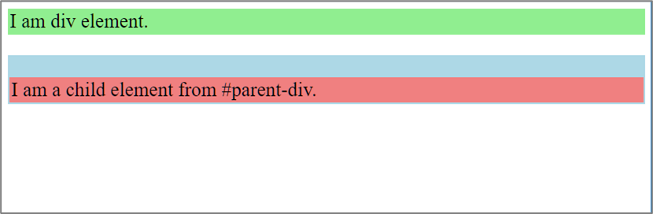

# Les 7 - Gevorderde oefeningen H9 - Lay-out: boxmodel en weergavemodel

Download en unzip, of clone deze repository. Hiervoor klik je op de groene knop.

## Oefening 1 - CSS Logical Properties

- Open de webpagina **01_css_logical_properties.html**.
- De opgave voor deze oefening vind je in de webpagina **01_css_logical_properties.html** zelf.

## Oefening 2 - Collapsing Margins

We weten dat de marges van twee opeenvolgende elementen worden samengevoegd. Maar er is ook nog een tweede situatie waarin marges (soms) worden samengevoegd:

- Open de webpagina **02_collapsing_margins.html** in Visual Studio Code en Google Chrome.
- Bekijk de css-code. Je ziet dat elke div een andere kleur heeft en 2 pixels padding.
- Stel de lettergrootte voor het body-element in op 1,5 rem.
- Geef *child-div* een bovenmarge van 25 pixels.
- Geef ook *parent-div* een bovenmarge van 25 pixels.

- Wat zal er gebeuren als je de twee pixels padding verwijdert bij *parent-div*? (Lees eventueel de laatste paragraaf op pagina 267 in het boek aandachtig opnieuw.) 
Verwijder de 2 pixels padding (plaats de declaratie in commentaar) en controleer of je antwoord juist was.

